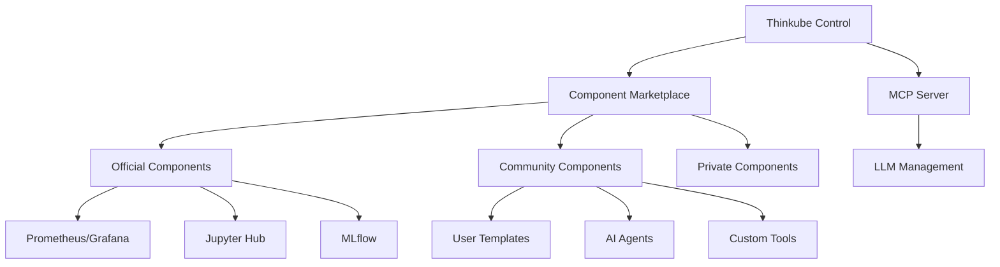

# Thinkube Control - Vision

## Overview

Thinkube Control will evolve from a management interface into a **marketplace/hub** for community components, serving as the central point for discovering, installing, and managing both official and community-contributed components.

## Architecture Vision



## Key Features

### Component Marketplace
- Browse official and community components
- One-click installation from Control UI
- Ratings, reviews, and compatibility info
- Resource requirements and dependencies

### Community Contributions
- Component Development Kit (CDK)
- Standardized component format
- Review and validation process
- Template sharing and forking

### MCP/LLM Integration
- Install components via natural language
- Automated configuration generation
- Intelligent dependency resolution
- Context-aware recommendations

## Component Standard

Components will follow a standardized format:

```yaml
apiVersion: marketplace.thinkube.io/v1
kind: Component
metadata:
  name: component-name
  namespace: thinkube-official
spec:
  description: "Component description"
  author: 
    name: "Author Name"
    verified: true
  category: "Category"
  version: "1.0.0"
  requires:
    core: []
    optional: []
  parameters: []
  source:
    type: helm/kustomize/ansible
    repo: "https://..."
```

## Development Workflow

1. **Component Development**
   ```bash
   tkube component init my-component
   tkube component validate
   tkube component test
   tkube component submit
   ```

2. **Installation from Control**
   - Browse marketplace
   - Configure parameters
   - One-click deploy
   - Monitor status

## Future Roadmap

1. **Phase 1**: Template system for thinkube-control
2. **Phase 2**: Basic marketplace UI
3. **Phase 3**: Community contributions
4. **Phase 4**: MCP/LLM integration
5. **Phase 5**: Premium components